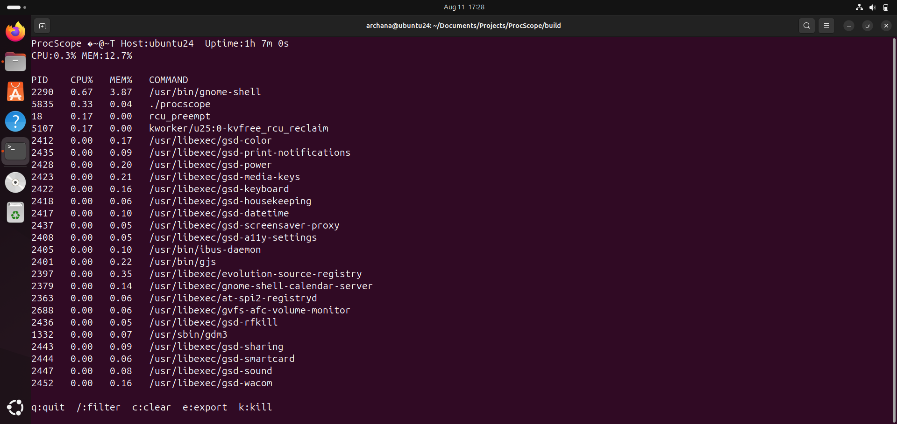

# ProcScope — Terminal System Monitor (C++17, ncurses)

ProcScope is a lightweight terminal-based system monitor written in C++17.
It reads from the Linux `/proc` filesystem and displays:
- overall CPU and memory usage
- a live list of top processes (sorted by CPU usage)
- human-readable uptime, hostname, and current time
- optional CPU temperature if available on the host

Key features
- multithreaded background updater for smooth UI
- ncurses-based UI with improved layout and color highlights
- process filtering, JSON snapshot export, and in-UI process termination
- optional CPU temperature detection (skips gracefully if not present)

## Screenshot


Build & Run (Debian/Ubuntu)
```bash
sudo apt-get update
sudo apt-get install -y build-essential cmake libncurses5-dev libncursesw5-dev nlohmann-json3-dev
mkdir build && cd build
cmake ..
make
./procscope
```

Controls inside ProcScope
- q : quit
- / : filter processes by name
- c : clear filter
- e : export JSON snapshot (`procscope_snapshot.json`)
- k : kill process by PID (prompts for PID)

Author: Your Name (change to your name before publishing)

